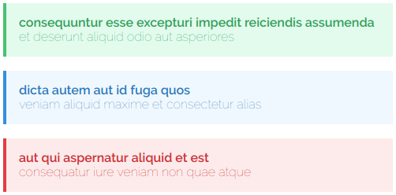

<p align="center"></p>

<p align="center"><b>Laraflash</b> provides a handy way to work with the flash messages.</p>

<p align="center">
  <a href="https://github.com/coderello/laraflash/releases"></a>
  <a href="LICENSE.md"></a>
  <a href="https://styleci.io/repos/149364639"></a>
  <a href="https://scrutinizer-ci.com/g/coderello/laraflash"></a>
  <a href="https://scrutinizer-ci.com/g/coderello/laraflash/code-structure"></a>
</p>

## Install

You can install this package via composer using this command:

```bash
composer require coderello/laraflash 
```

After that you need to register the `\Coderello\Laraflash\Middleware\HandleLaraflash::class` middleware after the `\Illuminate\Session\Middleware\StartSession::class` one in the `app\Http\Kernel.php`

You can publish the config file with:

```bash
php artisan vendor:publish --tag="laraflash-config"
```

## Adding flash messages

There are many syntax variations for adding flash messages, so you can choose the one you like the most.

Let's take a look at some of them.

```php
use Coderello\Laraflash\Facades\Laraflash;

Laraflash::message()->content('Some content')->title('Some title')->type('success');
```

> `message()` method creates and returns fresh `FlashMessage` instance which can be modified by chaining methods (all methods could be found in the `FlashMessage methods` section).

```php
laraflash()->message()->content('Some content')->title('Some title')->type('success');
```

> `Laraflash` facade can be replaced with the `laraflsh()` helper as you could saw in the example above.

```php
laraflash()->message('Some content', 'Some title')->success();
```

> `message()` method accepts up to five arguments: `$content`, `$title`, `$type`, `$delay`, `$hops`.

```php
laraflash('Some content', 'Some title')->success();
```

> Arguments mentioned in the previous example can be passed directly to the `laraflash()` helper.

## Rendering flash messages

Ready flash messages could be rendered using the `render()` method of the `Laraflash` instance.

```php
laraflash()->render();
```

> All methods of the `Laraflash` instance (which could be obtained by calling `laraflash()` helper without arguments being passed) could be found in the `Laraflash methods` section.

> Output HTML will be generated using skin, specified in the `laraflash.skin` config. All available skins are listed in the config file.

```html
<div class="alert alert-danger" role="alert">
   Danger message.
</div><br><div class="alert alert-info" role="alert">
   Info message.
</div>
```

> Default separator between the messages is the `<br>`, which is specified in the `laraflash.separator` config. Feel free to change it if you need.

Example of messages rendered as HTML:



## Obtaining flash messages as an array

Flash messages can be obtained as an array using the `toArray()` method.

```php
laraflash()->toArray();
```

Here is the result:

```
[
  [
    "title" => null,
    "content" => "Instant message.",
    "type" => "danger",
    "hops" => 1,
    "delay" => 0,
  ],
]
```

> You can use array representation of flash messages for your API.


## `Laraflash` methods

#### `message(?string $content = null, ?string $title = null, ?string $type = null, ?int $delay = null, ?int $hops = null): FlashMessage`

Creates and returns fresh `FlashMessage` instance.

#### `render()`

Renders ready flash messages as HTML.

#### `keep(): self`

Adds one more hop to each flash message.

#### `clear(): self`

Deletes all flash messages.

#### `all(): Collection`

Returns the `Collection` instance containing all flash messages.

#### `ready(): Collection`

Returns the `Collection` instance containing ready flash messages.

#### `touch(): self`

Touches all flash messages (decrements amount of hops and delay, deletes expired messages).

#### `toArray()`

Returns an array representation of ready flash messages.

#### `toJson()`

Returns JSON representation of ready flash messages.

## `FlashMessage` methods

#### `content(?string $content): self`

Sets the content of the flash message.

#### `title(?string $title): self`

Sets the title of the flash message.

#### `type(?string $type): self`

Sets the type of the flash message.

#### `danger(): self`

Sets the `danger` type for the flash message.

#### `warning(): self`

Sets the `warning` type for the flash message.

#### `info(): self`

Sets the `info` type for the flash message.

#### `success(): self`

Sets the `success` type for the flash message.

#### `hops(int $hops): self`

Sets the hops amount of the message (the number of requests in which the message will be present).
> Default: 1

#### `delay(int $delay): self`

Sets the delay of the message (the number of requests in which the message will be waiting to receive the ready state).
> Default: 1

#### `now(): self`

Shortcut for `->delay(0)`

#### `keep(): self`

Increments the amount of hops.

#### `attribute(string $key, $value = null): self`

Sets the custom attribute which will be present in the array representation of the message and could be obtained using the `get()` method.

#### `get(string $key)`

Returns the value of the attribute.

#### `toArray()`

Returns an array representation of the message.

#### `toJson()`

Returns JSON representation of the message.

## Testing

You can run the tests with:

```bash
composer test
```

## Changelog

Please see [CHANGELOG](CHANGELOG.md) for more information what has changed recently.

## Contributing

Please see [CONTRIBUTING](CONTRIBUTING.md) for details.

## License

The MIT License (MIT). Please see [License File](LICENSE.md) for more information.
